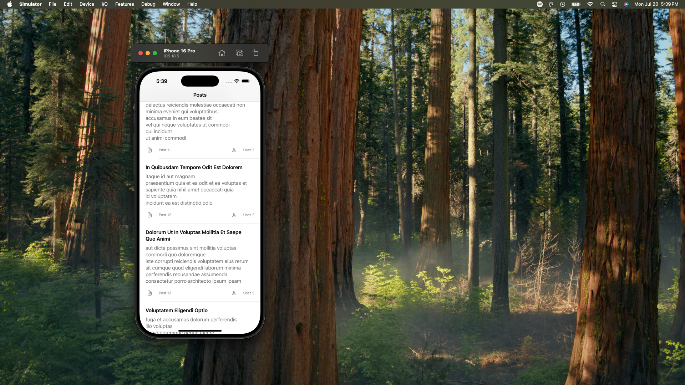
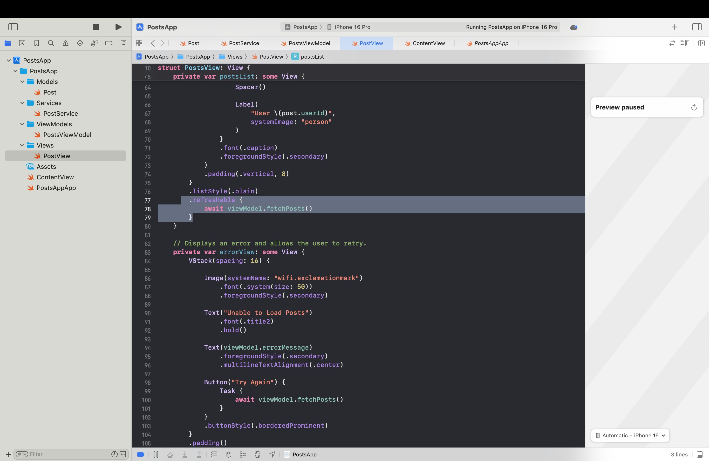
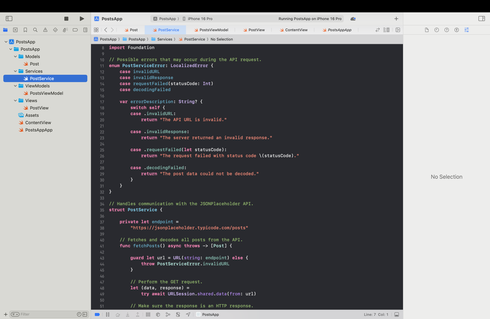

# PostsApp
# Posts App

## Project Description

Posts App is a SwiftUI application that retrieves and displays
all posts from the JSONPlaceholder API.

The project demonstrates URLSession networking, Codable JSON
decoding, async/await, loading and error states, and the MVVM
design pattern.

## API Endpoint

https://jsonplaceholder.typicode.com/posts

## Features

- Fetches all posts from JSONPlaceholder
- Uses URLSession to perform a GET request
- Uses Codable and JSONDecoder
- Displays posts in a SwiftUI List
- Displays each post's title, body, post ID, and user ID
- Shows a loading indicator
- Handles networking and decoding errors
- Includes a retry button
- Supports pull-to-refresh

## MVVM File Structure

### Model

`Post.swift` represents one post returned by the API.

Each post contains:

- userId
- id
- title
- body

### Service

`PostService.swift` performs the API request, checks the HTTP
response, and decodes the JSON response into an array of Post
objects.

### ViewModel

`PostsViewModel.swift` calls the service and stores the posts,
loading state, and error message.

### View

`PostsView.swift` displays the posts and responds to changes
published by the ViewModel.

## Known Issues

No known issues at this time.

## Screenshots

## Frontend/UI Screenshots

### Main Screen

### Pull-to-Refresh Interaction

## Backend/Logic

### Post Service

